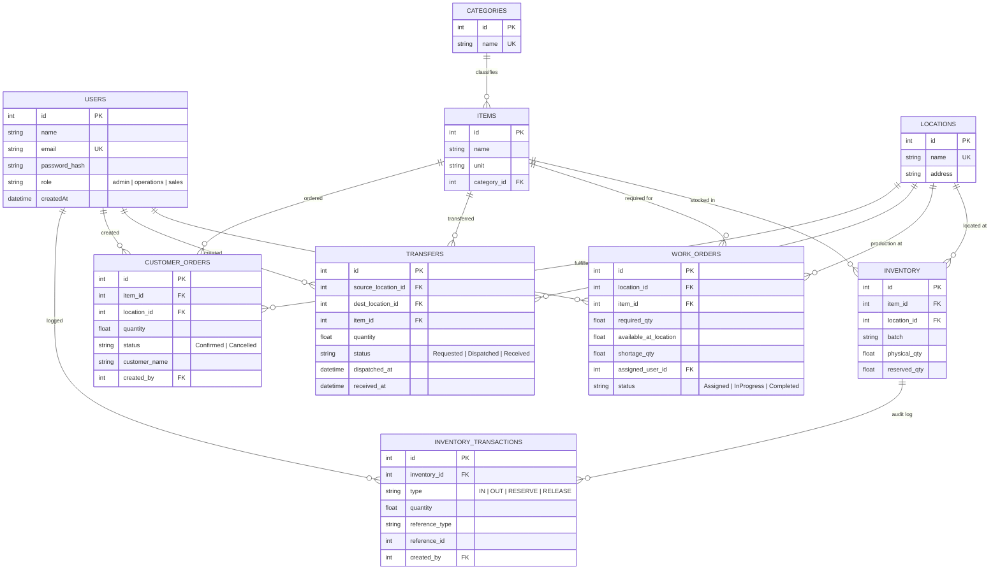

# Mini Operations ERP

> **Production-Ready Full-Stack Operations ERP**  
> Built for College Placement Technical Case Study 2.

A multi-location ERP system managing the complete supply-chain flow:
**Inventory → Work Order → Stock Check → Internal Transfer / Shortage → Customer Reservation**

---

## Table of Contents
1. [Tech Stack](#tech-stack)
2. [Architecture & Design Principles](#architecture--design-principles)
3. [Database Schema & ER Diagram](#database-schema--er-diagram)
4. [Project Setup & Running](#project-setup--running)
5. [Automated Test Suite](#automated-test-suite)
6. [API Documentation (Swagger)](#api-documentation-swagger)
7. [Demo Video Walkthrough Script (5–7 Mins)](#demo-video-walkthrough-script)
8. [Live Verification & Interview Defense Guide](#live-verification--interview-defense-guide)

---

## Tech Stack

| Layer | Technology | Details |
|---|---|---|
| **Frontend** | React 19 + Vite 8 | Ultra-fast SPA with modern hooks |
| **Styling** | TailwindCSS v4 | Clean enterprise dashboard UI |
| **Routing** | React Router v7 | Protected routes with role guards |
| **HTTP Client** | Axios | Automatic JWT bearer header injection & 401 interception |
| **Backend** | Node.js (v22+) + Express | RESTful APIs with modular service/controller architecture |
| **Database** | SQLite (Node `node:sqlite` engine) | Relational, ACID-compliant, zero-configuration, fully portable |
| **Security** | JWT, bcryptjs, Helmet, CORS | Secure hashing (salt rounds = 10) & RBAC middleware |
| **API Docs** | Swagger UI (`swagger-ui-express`) | OpenAPI 3.0 interactive documentation at `/api-docs` |
| **Testing** | Jest + Supertest | 14 automated unit, integration, and concurrency tests |

---

## Architecture & Design Principles

### 1. Role-Based Access Control (RBAC)
- **Admin**: Full access. Creates Work Orders, monitors all warehouses.
- **Operations User**: Manages inventory stock levels and initiates/dispatches/receives internal stock transfers.
- **Sales User**: Places customer orders and performs atomic stock reservations.
- Enforced on the backend via `auth` and `authorize(...roles)` middlewares.

### 2. Available Quantity Formula & Business Logic
$$\text{Available Qty} = \text{Physical Qty} - \text{Reserved Qty}$$
- Physical stock is only decreased upon **Transfer Dispatch** or final fulfillment.
- Placing an order increases **Reserved Qty**, reducing **Available Qty** without modifying physical goods prematurely.

### 3. Concurrency-Safe Stock Reservation
- When multiple sales users simultaneously attempt to reserve stock for the same SKU:
  - Database transactions execute the stock check and reservation atomically.
  - If available stock is 100, and User A requests 80 while User B requests 50 at the exact same millisecond, the database transaction ensures only one succeeds and the other receives `400 Bad Request: Insufficient available stock`.

### 4. Two-Stage Internal Stock Transfer
- **On Dispatch**: Source physical inventory decreases immediately (`OUT` audit transaction logged). Destination stock does **NOT** increase.
- **In Transit**: Transfer is marked `Dispatched`.
- **On Receipt**: Destination physical inventory increases (`IN` audit transaction logged).
- **Idempotency Guard**: Once received, `received_at` timestamp is set and subsequent receipt attempts are rejected with `409 Conflict`.

---

## Database Schema & ER Diagram



---

## Project Setup & Running

### Prerequisites
- Node.js version 22.5+ or 24+ installed (Node 24 is recommended and pre-tested).
- Git installed.

### 1. Backend Setup
```bash
cd backend
npm install

# Seed sample users, locations, items, and inventory
npm run seed

# Start development server
npm start
```
- Backend starts at: `http://localhost:5000`
- Swagger API Docs at: `http://localhost:5000/api-docs`

### 2. Frontend Setup
Open a second terminal window:
```bash
cd frontend
npm install

# Start Vite React server
npm run dev
```
- Frontend runs at: `http://localhost:3000`

### Pre-Seeded Credentials

| Role | Email | Password | Allowed Capabilities |
|---|---|---|---|
| **Admin** | `admin@erp.com` | `admin123` | Work Orders, View All, Manage System |
| **Operations** | `ops@erp.com` | `ops123` | Add Stock, Dispatch/Receive Transfers, Work Order Status |
| **Sales** | `sales@erp.com` | `sales123` | Create Customer Orders, Reserve Stock, Cancel Orders |

---

## Automated Test Suite

All 5 mandatory tests specified in the problem statement + high-concurrency race condition tests are implemented and passing.

Run tests:
```bash
cd backend
npm test:jest
```

### Verified Test Cases:
1. **Test 1**: Cannot reserve more than available inventory (Returns `400 Bad Request`).
2. **Test 2**: Cannot transfer more than available inventory (Returns `400 Bad Request`).
3. **Test 3**: Destination stock remains 0 after dispatch, and increases strictly upon receipt.
4. **Test 4**: Same transfer cannot be received twice (Returns `409 Conflict`).
5. **Test 5**: Unauthorized user cannot perform restricted operation (Sales user gets `403 Forbidden` on work order creation; Operations gets `403` on sales orders; unauthenticated gets `401 Unauthorized`).
6. **Concurrency Suite**: Simultaneous requests with `Promise.all` reserving 80 and 50 against 100 available stock — database transaction prevents double-allocation; exactly 1 succeeds and 1 fails.

---

## API Documentation (Swagger)

Interactive Swagger / OpenAPI 3.0 documentation is served directly from the backend:
- URL: `http://localhost:5000/api-docs`
- Raw JSON specification: `http://localhost:5000/api-docs.json`

### Core Endpoints

| Method | Endpoint | Role | Description |
|---|---|---|---|
| `POST` | `/api/auth/login` | Public | Authenticates credentials and returns JWT token |
| `GET` | `/api/auth/me` | Authenticated | Returns current profile and active role |
| `GET` | `/api/inventory` | Authenticated | Lists all stock with calculated `available_qty` |
| `GET` | `/api/inventory/:id` | Authenticated | Detail view with transaction audit history |
| `POST` | `/api/inventory` | Admin, Ops | Adds or adjusts stock with `IN` transaction |
| `GET` | `/api/work-orders` | Admin, Ops | Lists all work orders |
| `POST` | `/api/work-orders` | Admin | Creates work order with automated shortage calculation |
| `PATCH` | `/api/work-orders/:id/status`| Admin, Ops | Updates status (`Assigned` → `InProgress` → `Completed`) |
| `GET` | `/api/transfers` | Admin, Ops | Lists internal stock transfers |
| `POST` | `/api/transfers` | Admin, Ops | Requests an internal transfer |
| `PATCH` | `/api/transfers/:id/dispatch`| Admin, Ops | Dispatches transfer (deducts source stock) |
| `PATCH` | `/api/transfers/:id/receive` | Admin, Ops | Receives transfer (increases destination stock; idempotent) |
| `GET` | `/api/orders` | Admin, Sales | Lists customer orders |
| `POST` | `/api/orders` | Admin, Sales | Places order and atomically reserves inventory |
| `PATCH` | `/api/orders/:id/cancel` | Admin, Sales | Cancels order and releases reserved stock back to available |

---

## Demo Video Walkthrough Script

*Recommended 5–7 minute structure for your presentation recording:*

1. **Introduction (30s)**:
   - Introduce yourself and mention the project: Mini Operations ERP.
   - Mention the tech stack: React 19, Node.js, SQLite with ACID transactions, JWT authentication, and Swagger docs.

2. **Login & Role Authorization (1 min)**:
   - Log in as `admin@erp.com`.
   - Point out the Topbar role indicator and the "Demo Switch" toolbar.
   - Show how accessing restricted actions is guarded.

3. **Inventory Management (1 min)**:
   - Go to `/inventory`.
   - Explain the columns: Physical Qty, Reserved Qty, Available Qty.
   - Emphasize the formula: $\text{Available} = \text{Physical} - \text{Reserved}$.
   - Click "Audit Log" on any item to show the transaction history (`IN`, `OUT`, `RESERVE`, `RELEASE`).

4. **Work Order & Material Shortage Check (1.5 min)**:
   - Go to `/work-orders`.
   - Click "+ New Work Order".
   - Select Location `Warehouse A`, Item `Copper Wire 2m`, and set Required Quantity to `150` (Stock is `100`).
   - Show how the modal dynamically calculates:
     - Available at Location = 100
     - Required = 150
     - Calculated Shortage = 50!
   - Submit the order. Point out the red badge: `Shortage: 50`.
   - Click the "Transfer Stock →" shortcut button.

5. **Internal Stock Transfer Flow (1.5 min)**:
   - In `/transfers`, show the Requested transfer.
   - Explain the two-stage rule:
     - Click **Dispatch**: Verify source inventory physically decreases, but destination inventory does NOT increase yet.
     - Click **Confirm Receipt**: Verify destination inventory now increases.
     - Show that the button is now locked and cannot be received a second time (idempotency guard).

6. **Customer Order & Concurrency Reservation (1 min)**:
   - Switch role to Sales User (`sales@erp.com`).
   - Go to `/orders`.
   - Create an order for 40 units of an item with 70 available.
   - Show that physical quantity remains 70, reserved quantity increases to 40, and available quantity drops to 30.
   - Attempt to place an order for 50 units → Show the system blocks it with an insufficient stock error.
   - Click "Cancel & Release" → Show that the reserved stock is immediately returned to available!

7. **Automated Tests & Wrap-Up (30s)**:
   - Switch to terminal, run `npm test:jest`, and show all 14 tests passing.

---

## Live Verification & Interview Defense Guide

*Be fully prepared if the interviewer asks you to implement one of the unannounced changes during the live interview round:*

### Change 1: Add DAMAGED QUANTITY
**Question**: "Add Damaged Quantity so damaged stock automatically reduces available stock."
**Answer**:
1. In `database.js` table schema: Add `damaged_qty REAL NOT NULL DEFAULT 0` to `inventory` table.
2. Update the `available_qty` calculation in `models/index.js` and frontend:
   $$\text{Available Qty} = \text{Physical Qty} - \text{Reserved Qty} - \text{Damaged Qty}$$
3. Add an endpoint `POST /api/inventory/:id/damage` with quantity to update `damaged_qty = damaged_qty + qty` and log an inventory transaction with type `DAMAGE`.

### Change 2: Allow a Transfer to be Partially Received
**Question**: "Allow a transfer to be partially received."
**Answer**:
1. In `transfers` table, add `received_quantity REAL DEFAULT 0`.
2. In `receiveTransfer` (`transfer.controller.js`):
   - Accept `received_qty` in request body.
   - Add `received_qty` to destination inventory.
   - If `received_quantity + received_qty < transfer.quantity`, set status to `'PartiallyReceived'`.
   - If equal, set status to `'Received'`.

### Change 3: Cancel an Order and Correctly Release Reserved Inventory
**Answer**:
- **Already fully implemented!**
- See `cancelOrder` in `backend/src/controllers/order.controller.js` and the "Cancel & Release" button on the frontend `/orders` page.
- It finds the reservation log, decrements `reserved_qty`, logs a `RELEASE` transaction, and sets order status to `'Cancelled'`.

### Change 4: Restrict Users to Only Their Assigned Location
**Question**: "Restrict users to only see and manage their assigned location."
**Answer**:
1. Add `location_id INTEGER` to `users` table.
2. In `auth` middleware, attach user's `location_id` to `req.user`.
3. In `inventory.controller.js`, `workorder.controller.js`, etc., if `req.user.role !== 'admin'`, enforce `where location_id = req.user.location_id`.
